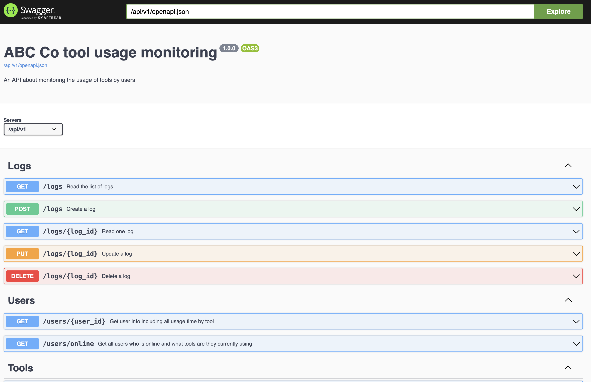

# Tools usage monitoring

This project is used as an example to receive user logs from different tools/systems, and then store them into a mongodb for further analysis.
Can take Gmail, Google Drive and YouTube as an analogy to the tools.

After setup and started the server, there will be a Swagger UI console with live documentation and ‘try it out’ feature under the url: http://127.0.0.1:8000/api/v1/ui/


## Tech
- python 3
  - Flask
  - connexion
  - pydantic
  - Swagger UI for OpenAPI
- Mongodb

## Setup

### Mongodb
1. Create database in the mongodb instance:  
    ```
    USE ABC;
   ```
2. Create collection `logs` in the database:  
    ```
   db.createCollection('logs');
   ```
3. Create unique index on `log_id`:  
   ```
    db.logs.createIndex({'log_id': 1}, {unique: true});
   ```

### Project
1. Setup mongodb as above
2. Install python modules by 
    ```sh
    pip install -r requirements.txt
   ```
3. Add `.env` under `src/monitor-data-mongodb`. Can refer to `.env.example` under the same directory
4. To start the server, run
    ```sh
    python src/monitor-data-mongodb/app.py
    ```


## System Structure


## Assumption
1. Each tool will have their unique `log_id`.
2. Users use the same account across different tools, so when usage log is sent to this server from them, they will come with the same `user_id`

## Mongodb schema
We will only use one collection `logs` for all the log records:

| Field     | Type     | Description                      |
|-----------|----------|:---------------------------------|
| _id       | ObjectId | Mongodb object id                |
| log_id    | String   | Unique id across different tools |
| tool_id   | String   | Tool unique id                   |
| user_id   | String   | User unique id                   |
| start_dt  | ISODate  | User session start datetime      |
| end_dt    | ISODate  | User session end datetime        |
| create_dt | ISODate  | Record created datetime          |
| update_dt | ISODate  | Record updated datetime          |
| is_delete | Boolean  | Is Record soft deleted or not    |
| delete_dt | ISODate  | Record soft delete datetime      |

In case we want to put more detail for further analysis, e.g. user's gender, country, tool's version, 
we can add another collections `users` and `tools`, and use mongodb `aggregate` and `$lookup` to group them together. 
